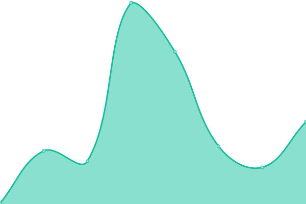
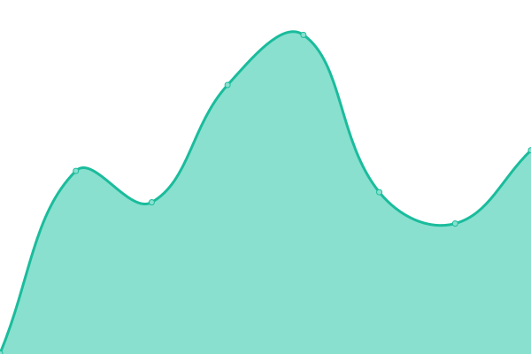
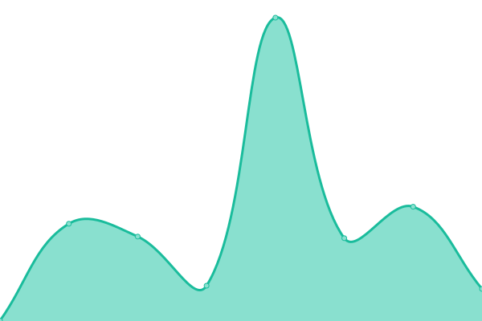
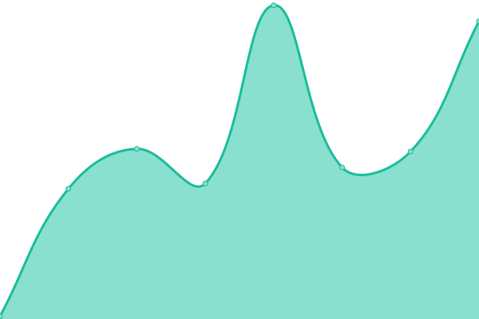
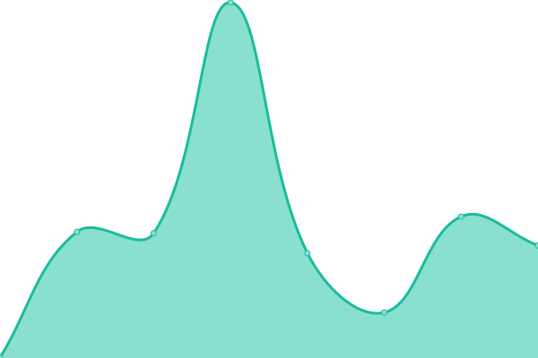
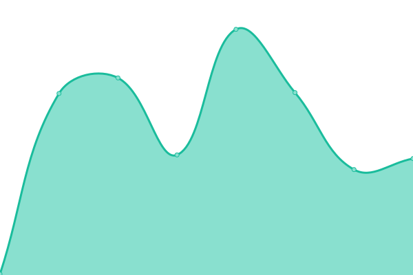
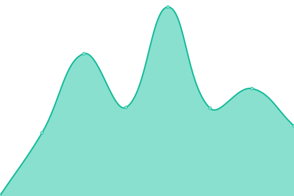
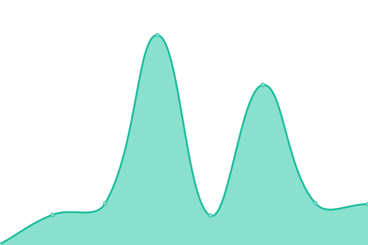
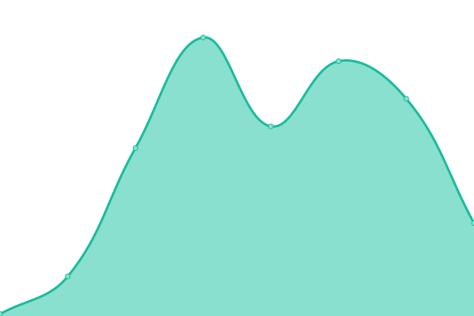
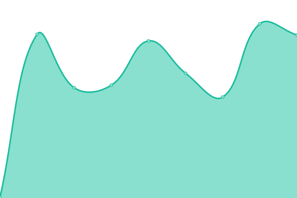

# [📈 Live Status](https://upptime.github.io/upptime): <!--live status--> **🟩 All systems operational**

This repository contains the open-source uptime monitor and status page for [Upptime](https://upptime.js.org), powered by [Upptime](https://github.com/upptime/upptime).

With [Upptime](https://upptime.js.org), you can get your own unlimited and free uptime monitor and status page, powered entirely by a GitHub repository. We use [Issues](https://github.com/upptime/upptime/issues) as incident reports, [Actions](https://github.com/upptime/upptime/actions) as uptime monitors, and [Pages](https://upptime.github.io/upptime) for the status page.

<!--start: status pages-->
<!-- This summary is generated by Upptime (https://github.com/upptime/upptime) -->
<!-- Do not edit this manually, your changes will be overwritten -->
<!-- prettier-ignore -->
| URL | Status | History | Response Time | Uptime |
| --- | ------ | ------- | ------------- | ------ |
|  [Google](https://www.google.com) | 🟩 Up | [google.yml](https://github.com/Raraby/upptime/commits/HEAD/history/google.yml) | 

 70ms
     
 | 

<a href="https://raraby.github.io/upptime/history/google">100.00%</a>
    

|  [Minecrosoft](https://www.microsoft.com) | 🟩 Up | [minecrosoft.yml](https://github.com/Raraby/upptime/commits/HEAD/history/minecrosoft.yml) | 

 325ms
     
 | 

<a href="https://raraby.github.io/upptime/history/minecrosoft">100.00%</a>
    

|  [Google Translate](https://translate.google.co.jp) | 🟩 Up | [google-translate.yml](https://github.com/Raraby/upptime/commits/HEAD/history/google-translate.yml) | 

 154ms
     
 | 

<a href="https://raraby.github.io/upptime/history/google-translate">100.00%</a>
    

|  [Google Photo](https://photos.google.com) | 🟩 Up | [google-photo.yml](https://github.com/Raraby/upptime/commits/HEAD/history/google-photo.yml) | 

 138ms
     
 | 

<a href="https://raraby.github.io/upptime/history/google-photo">100.00%</a>
    

|  [Google Play](https://play.google.com/store) | 🟩 Up | [google-play.yml](https://github.com/Raraby/upptime/commits/HEAD/history/google-play.yml) | 

 448ms
     
 | 

<a href="https://raraby.github.io/upptime/history/google-play">100.00%</a>
    

|  [Google MAP](https://www.google.co.jp/maps) | 🟩 Up | [google-map.yml](https://github.com/Raraby/upptime/commits/HEAD/history/google-map.yml) | 

 439ms
     
 | 

<a href="https://raraby.github.io/upptime/history/google-map">100.00%</a>
    

|  [Hypixel](https://hypixel.net) | 🟩 Up | [hypixel.yml](https://github.com/Raraby/upptime/commits/HEAD/history/hypixel.yml) | 

 215ms
     
 | 

<a href="https://raraby.github.io/upptime/history/hypixel">99.39%</a>
    

|  [Hypixel API](https://api.hypixel.net) | 🟩 Up | [hypixel-api.yml](https://github.com/Raraby/upptime/commits/HEAD/history/hypixel-api.yml) | 

 118ms
     
 | 

<a href="https://raraby.github.io/upptime/history/hypixel-api">100.00%</a>
    

|  [Plancke](https://plancke.io/hypixel/player/stats/) | 🟩 Up | [plancke.yml](https://github.com/Raraby/upptime/commits/HEAD/history/plancke.yml) | 

 284ms
     
 | 

<a href="https://raraby.github.io/upptime/history/plancke">100.00%</a>
    

|  [Youtube](https://www.youtube.com) | 🟩 Up | [youtube.yml](https://github.com/Raraby/upptime/commits/HEAD/history/youtube.yml) | 

 605ms
     
 | 

<a href="https://raraby.github.io/upptime/history/youtube">100.00%</a>
    

|  [Discord](https://discord.com/) | 🟩 Up | [discord.yml](https://github.com/Raraby/upptime/commits/HEAD/history/discord.yml) | 

 116ms
     
 | 

<a href="https://raraby.github.io/upptime/history/discord">100.00%</a>
    

|  [Instagram](https://www.instagram.com) | 🟩 Up | [instagram.yml](https://github.com/Raraby/upptime/commits/HEAD/history/instagram.yml) | 

 639ms
     
 | 

<a href="https://raraby.github.io/upptime/history/instagram">100.00%</a>
    

|  [Minecraft](https://www.minecraft.net) | 🟩 Up | [minecraft.yml](https://github.com/Raraby/upptime/commits/HEAD/history/minecraft.yml) | 

 725ms
     
 | 

<a href="https://raraby.github.io/upptime/history/minecraft">100.00%</a>
    

|  [Twitch](https://www.twitch.tv) | 🟩 Up | [twitch.yml](https://github.com/Raraby/upptime/commits/HEAD/history/twitch.yml) | 

 147ms
     
 | 

<a href="https://raraby.github.io/upptime/history/twitch">100.00%</a>
    

|  [Osu](https://osu.ppy.sh/home) | 🟩 Up | [osu.yml](https://github.com/Raraby/upptime/commits/HEAD/history/osu.yml) | 

 195ms
     
 | 

<a href="https://raraby.github.io/upptime/history/osu">100.00%</a>
    

|  [Google Drive](https://drive.google.com/drive) | 🟩 Up | [google-drive.yml](https://github.com/Raraby/upptime/commits/HEAD/history/google-drive.yml) | 

 222ms
     
 | 

<a href="https://raraby.github.io/upptime/history/google-drive">100.00%</a>
    

|  [Google Cloud](https://console.cloud.google.com) | 🟩 Up | [google-cloud.yml](https://github.com/Raraby/upptime/commits/HEAD/history/google-cloud.yml) | 

 192ms
     
 | 

<a href="https://raraby.github.io/upptime/history/google-cloud">100.00%</a>
    

|  [OneDrive](https://onedrive.live.com) | 🟩 Up | [one-drive.yml](https://github.com/Raraby/upptime/commits/HEAD/history/one-drive.yml) | 

 198ms
     
 | 

<a href="https://raraby.github.io/upptime/history/one-drive">100.00%</a>
    

|  [GitHub](https://github.com) | 🟩 Up | [git-hub.yml](https://github.com/Raraby/upptime/commits/HEAD/history/git-hub.yml) | 

 416ms
     
 | 

<a href="https://raraby.github.io/upptime/history/git-hub">100.00%</a>
    

|  [Cloudflare](https://www.cloudflare.com) | 🟩 Up | [cloudflare.yml](https://github.com/Raraby/upptime/commits/HEAD/history/cloudflare.yml) | 

 181ms
     
 | 

<a href="https://raraby.github.io/upptime/history/cloudflare">100.00%</a>
    

|  [Beyond Description](https://raraby.github.io/BeyondDescription/) | 🟩 Up | [beyond-description.yml](https://github.com/Raraby/upptime/commits/HEAD/history/beyond-description.yml) | 

 129ms
     
 | 

<a href="https://raraby.github.io/upptime/history/beyond-description">100.00%</a>
    

|  [Wikipedia](https://en.wikipedia.org) | 🟩 Up | [wikipedia.yml](https://github.com/Raraby/upptime/commits/HEAD/history/wikipedia.yml) | 

 97ms
     
 | 

<a href="https://raraby.github.io/upptime/history/wikipedia">100.00%</a>
    

<!--end: status pages-->

[**Visit our status website →**](https://upptime.github.io/upptime)

## 📄 License

- Powered by: [Upptime](https://github.com/upptime/upptime)
- Code: [MIT](./LICENSE) © [Upptime](https://upptime.js.org)
- Data in the `./history` directory: [Open Database License](https://opendatacommons.org/licenses/odbl/1-0/)

https://raraby.github.io/upptime/
